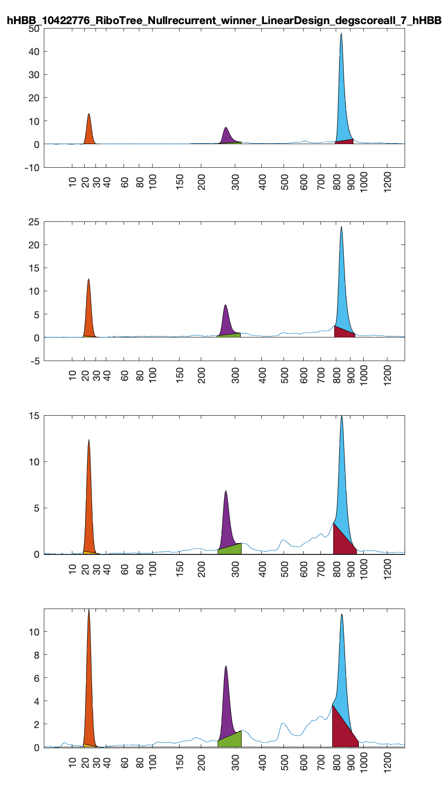
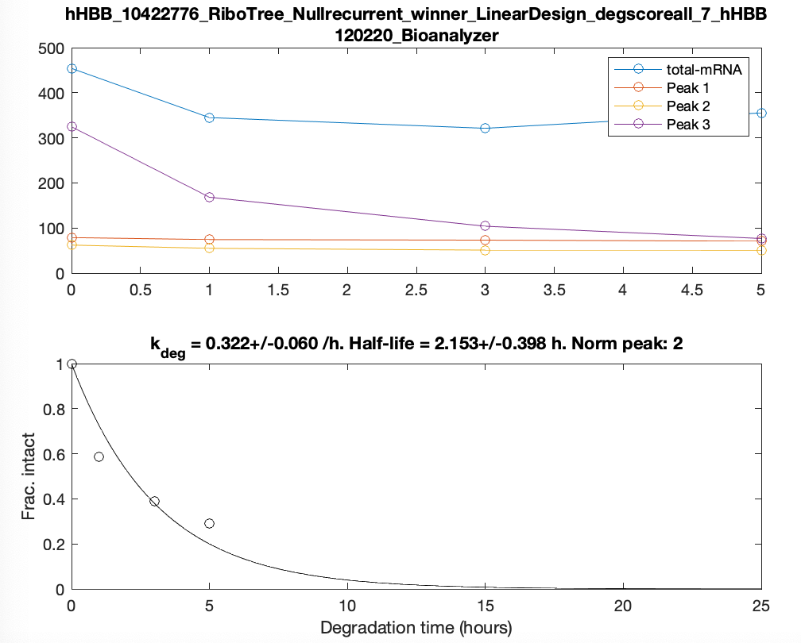
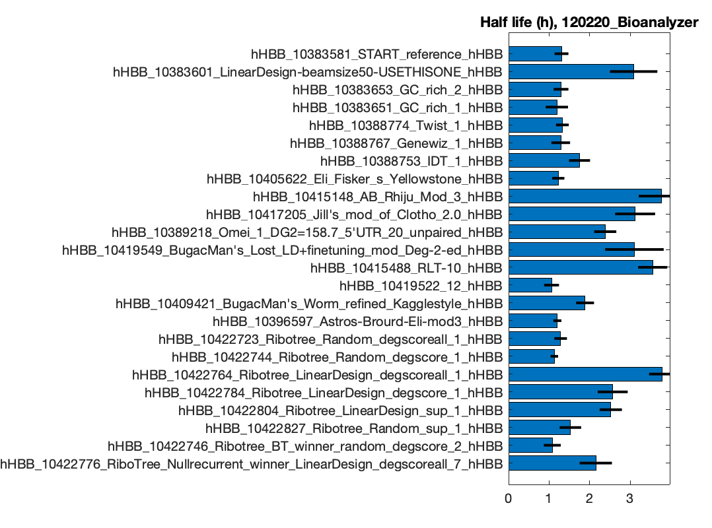
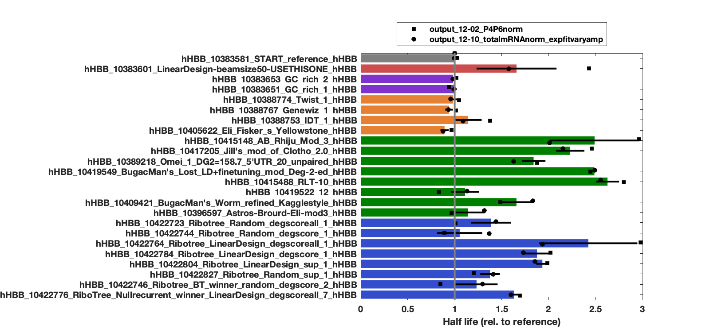

# openvaccine-CE-analysis

## What this is
Capillary electrophoresis data and analysis to measure in-solution stability of mRNA's for the manuscript:

Leppek, K., Byeon, G.W., Kladwang, W., Wayment-Steele, H.K., Kerr, C., ... Barna, M., Das, R. (2021). Combinatorial optimization of mRNA structure, stability, and translation for RNA-based therapeutics. https://www.biorxiv.org/content/10.1101/2021.03.29.437587v1.

## Contributors
+ Data were collected by W. Kladwang, Stanford University, based on mRNA's prepared as part of the OpenVaccine collaboration by Maria Barna's and Rhiju Das's lab at Stanford.
+ Capillary electrophoresis measurements were carried out on an Agilent Bioanalyzer instrument at the PAN facility at Stanford.
+ Code to convert bioanalyzer output to .csv files annotated with length by Do Soon Kim (visiting scholar).
+ Code to quantitate peak areas and estimate mRNA half-life by Do Soon Kim and Rhiju Das, Stanford.

## Example run
To fit a set of data collected on 24 mRNA's degraded for different amounts of time:

```
pk_nt_bounds = [20 30; 150 300; 820 1000]; 
output_pdf = 0;
%% 12-02 (4-timepoint survey), P4-P6, mRNA
data_dir = 'data/120220_Bioanalyzer';
pk_norm = 2; output_dir = 'output_12-02_P4P6norm'; 
output_1202_P4P6norm = analyze_bioanalyzer_data( data_dir, pk_nt_bounds, pk_norm, output_dir, output_pdf );
```

The information that the scripts need to figure out the files and timepoints are in `data/120220_Bioanalyzer/sample_nucleotide_filename.csv` and `data/120220_Bioanalyzer/platenumber_filename.csv`. 

Fits involve looking for peaks in the ranges noted in the `pk_nt_bounds` variable above. The first range (20-30 nts) is assumed to be the Bioanalyzer loading standard; the second range (150-300 nts) is assumed to be the P4-P6 RNA (as another co-loading standard); and the last range (820-1000 nts) corresponds to the length of Nanoluciferase mRNA, which is assumed to decay with time. 

The `pk_norm` specified which peak to use for normalization (2 means use the P4-P6 peak here; 0 would mean estimate the total mRNA in the trace that is not in the Bioanalyzer loading standard).

Here's an example set of fits. This data set only involves 4 timepoints; others in the paper typically involved 10 timepoints. Note that the 'background' under each peak is fit as a 'trapezoid'...




Subtracting off the trapezoids gives estimates of the peak areas, which then can be used to estimate fraction intact (relative to the first timepoint), and fit to an exponential: 



The fit is of the `k_deg` (degradation rate constant) for a first order exponential:

```
frac. intact = exp( - k_deg t )
```

Final output, after carrying out such first over all 24 mRNA's characterized in this experiment, looks like this:


Here, half-life is given by `Half life = ln(2)/k_deg`.

## Data on final 24 nLuc
Data given in final table S5 of manuscript average over 2 independent replicates, and are given in [averaged\_k\_deg\_MATLAB\_2020only.csv](averaged_k_deg_MATLAB_2020only.csv)
 
 Here's a plot of those replicates (commands are at end of 
 [rhiju\_bioanalyzer\_fits\_2020data\_SCRIPT.m](`rhiju_bioanalyzer_fits_2020data_SCRIPT.m`))
 


Please note that these are output from an analysis early in 2021 that went into manuscript. In a late-2021 re-run of above, the final numbers were slightly different (<10% change), due to small changes in the final fit parameters for the 12/10 data set.

## Complete analysis
A compilation of all the commands used to fit data for the manuscript is in [rhiju\_bioanalyzer\_fits\_2020data\_SCRIPT.m](`rhiju_bioanalyzer_fits_2020data_SCRIPT.m`), including not just the 24 nLuc's in the final study but also other half-life measurements involving, e.g. 6 example CDS's.


